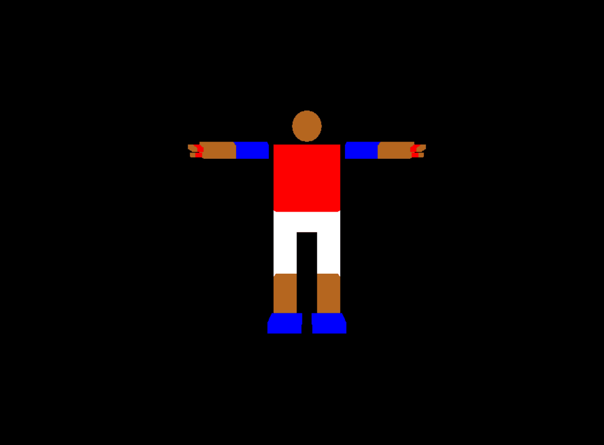

# SBE306B - Assignment 3- Camera Movement
**Under the supervision of: [Eng. Ayman Anwar](https://github.com/A-M-Anwar) and [Eng. Eslam Adel](https://github.com/EslamAdel)**

Now, we are adding a view transformations as we add **Camera** and use ```gluLookAt``` function and add some camera transormations until we reach something like this.


### 1. Setting the Camera
* First we will use **Double Buffer** mode so that our display of the changed pixels and buffers becomes faster
##### main()
```cpp
    glutInitDisplayMode(GLUT_DOUBLE | GLUT_RGB);
```
* Then, we will specify our viewing region to specify the vieweing frustum using ```gluPrespective```
##### init()
```cpp
    glMatrixMode(GL_PROJECTION);
    gluPerspective(65.0, (GLfloat)1024 / (GLfloat)869, 1.0, 60.0);
```
* And add the ```gluLookAt``` function at the begining of the **display** function

##### Global Variables
```cpp
double eye[] = { 0, 0, 2 };
double center[] = { 0, 0, 1 };
double up[] = { 0, 1, 0 };
```

##### display()
```cpp
gluLookAt(eye[0], eye[1], eye[2],
              center[0], center[1], center[2],
              up[0], up[1], up[2]);
```


### 2. Rotation in Left and Right around Vertical Axis
* You only need to change the ```eye``` as the ```up``` will remain looking in the same direction as Y-Direction. Rotation of a point around an axis is done with ```rotatePoint``` function.
* ```rotatePoint``` function takes ```a```; a pointer to double of the vector of the axis(line) to be rotated around, ```theta```; the angle of rotation  in radians, ```p```; the point to rotate around ```a``` by ```theta```. 

```cpp
void rotatePoint(double a[], double theta, double p[])
{

    double temp[3];
    temp[0] = p[0];
    temp[1] = p[1];
    temp[2] = p[2];

    temp[0] = -a[2] * p[1] + a[1] * p[2];
    temp[1] = a[2] * p[0] - a[0] * p[2];
    temp[2] = -a[1] * p[0] + a[0] * p[1];

    temp[0] *= sin(theta);
    temp[1] *= sin(theta);
    temp[2] *= sin(theta);

    temp[0] += (1 - cos(theta))*(a[0] * a[0] * p[0] + a[0] * a[1] * p[1] + a[0] * a[2] * p[2]);
    temp[1] += (1 - cos(theta))*(a[0] * a[1] * p[0] + a[1] * a[1] * p[1] + a[1] * a[2] * p[2]);
    temp[2] += (1 - cos(theta))*(a[0] * a[2] * p[0] + a[1] * a[2] * p[1] + a[2] * a[2] * p[2]);

    temp[0] += cos(theta)*p[0];
    temp[1] += cos(theta)*p[1];
    temp[2] += cos(theta)*p[2];

    p[0] = temp[0];
    p[1] = temp[1];
    p[2] = temp[2];

}

void Left()
{
    rotatePoint(up, (float)22/7/20, eye);
}

void Right()
{
    rotatePoint(up, -(float)22/7/20, eye);
}

```


### 3. Rotation in Up and Down around Horizontal Axis
* Now, not only the ```eye``` will be change but also the ```up``` as they both will rotate around a directon that is parallel with the X-Axis.
*  This direction will be calculated by calculating the cross product between the ```eye``` and ```up``` using ```crossProduct```.
*  ```crossProduct``` function takes three pointer to double (arrays of double); ```a```, ```b``` and ```c```. The function calculates the cross product between ```a``` and ```b``` and stores the results in ```c```.
*  The results needs to be nomralized before being rotated around using ```normalize``` which takes the vector and normalize it and returning the results in the same vector (change in-place).
*  Using ```rotatePoint``` function described before, we will rotate the ```eye``` and ```up``` around the normaized vector resulted from the cross product.
```cpp
void crossProduct(double a[], double b[], double c[])
{
    c[0] = a[1] * b[2] - a[2] * b[1];
    c[1] = a[2] * b[0] - a[0] * b[2];
    c[2] = a[0] * b[1] - a[1] * b[0];
}

void normalize(double a[])
{
    double norm;
    norm = a[0] * a[0] + a[1] * a[1] + a[2] * a[2];
    norm = sqrt(norm);
    a[0] /= norm;
    a[1] /= norm;
    a[2] /= norm;
}

void Up()
{
    double horizontal[] = {0, 0, 0};
    crossProduct(eye, up, horizontal);
    normalize(horizontal);
    rotatePoint(horizontal, 3.14/20, eye);
    rotatePoint(horizontal, 3.14/20, up);
}

void Down()
{
    double horizontal[] = {0, 0, 0};
    crossProduct(eye, up, horizontal);
    normalize(horizontal);
    rotatePoint(horizontal, -3.14/20, eye);
    rotatePoint(horizontal, -3.14/20, up);
}
```

### 4. Moving Forward and Backwards
* Here, ```up``` will remain the same, but, ```eye``` and ```center``` will be chnaged. Both will increase or decrease by a threshold in +Z or in -Z directions.
* This threshold ```direction`` is the difference between the ```center``` and ```eye```. The threshold is then subtracted from ```eye`` in ```center``` when moving forward and added when moving backwards.
* For a better resoultion, the threshold ```direction```  a factor ```speed``` before being added or subtracted from ```eye``` and ```center```.
```cpp
void moveForward()
{
    double direction[] = {0, 0, 0};
    direction[0] = center[0] - eye[0];
    direction[1] = center[1] - eye[1];
    direction[2] = center[2] - eye[2];

    eye[0] -= direction[0] * speed;
    eye[1] -= direction[1] * speed;
    eye[2] -= direction[2] * speed;

    center[0] -= direction[0] * speed;
    center[1] -= direction[1] * speed;
    center[2] -= direction[2] * speed;
}

void moveBack()
{
    double direction[] = {0, 0, 0};
    direction[0] = center[0] - eye[0];
    direction[1] = center[1] - eye[1];
    direction[2] = center[2] - eye[2];

    eye[0] += direction[0] * speed;
    eye[1] += direction[1] * speed;
    eye[2] += direction[2] * speed;

    center[0] += direction[0] * speed;
    center[1] += direction[1] * speed;
    center[2] += direction[2] * speed;
}
```

### 5. Setting Limits
* In our view transformations, limits are added just to avoid overlapping in the transformations like using forward too much may cause the camera to point at a point out of the viewing region.
* These limits can be easily ignored or discarded by commenting the increment and decrement of each limit 
```cpp
int limitForwardBackward = 0;
int limitUpDown = 0;
int limitRightLeft = 0;

void Left()
{
    rotatePoint(up, (float)22/7/20, eye);
    limitRightLeft += 1;
}
```

### 6. Key Actions

| Key |             Action             |
|:---:|:------------------------------:|
|  <kbd>R</kbd> OR <kbd>r</kbd> | Reset |
|  <kbd>&larr;</kbd> + MOUSE | Left |
|  <kbd>&rarr;</kbd> + MOUSE |  Right|
|  <kbd>&larr;</kbd> | Backward |
| <kbd>&rarr;</kbd>  |  Forward |
|  <kbd>&uarr;</kbd> | Up |
| <kbd>&darr;</kbd>  |  Down |

* For reseting and returning to the original view with no rotations, click <kbd>R</kbd> OR <kbd>r</kbd> as they assign the default values to our camera variables.
```cpp
case 'r':
case 'R':
    eye[0] = 0;
    eye[1] = 0;
    eye[2] = 2;
    center[0] = 0;
    center[1] = 0;
    center[2] = 1;
    up[0] = 0;
    up[1] = 1;
    up[2] = 0;
    angle = 0;
    angle2 = 0;
    limitRightLeft = 0;
    limitForwardBackward = 0;
    limitUpDown = 0;
    glutPostRedisplay();
    break;

```

* For left and right, you need to click on mouse and pressing left and right arrows. The way to do it in code is by setting a variable ```pressed``` whose value is changed when the mouse is pressed or released.
* Then when clicking either left or right arrows, we check the ```pressed```, if it is 1, then the mouse is still pressed and the program will do an action (rotate right). Else, the mouse is released and it will do another action.

```cpp
static void mouse(int button, int state, int x, int y)
{
    if (button == GLUT_LEFT_BUTTON) {
        if (state == GLUT_DOWN) {
            pressed = 1;
            moving = 1;
            startx = x;
            starty = y;
        }
        if (state == GLUT_UP) {
            moving = 0;
            pressed = 0;
        }
    }
}
```
##### ```specialKeys```
```cpp
case GLUT_KEY_LEFT:
    if(pressed==0) {
        if (limitForwardBackward < 10) {
            moveForward();
        }
    }
    else {
        if (limitRightLeft < 10) {
            Left();
        }
    }
    break;
```

